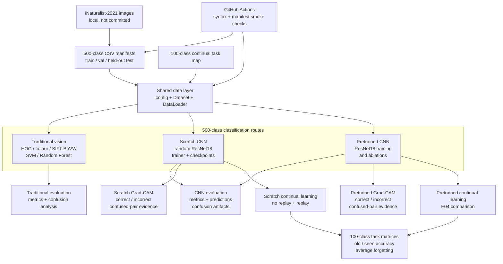

<h1 align="center">COMP9517 2026 T2 Group Project</h1>

<p align="center">
  Fine-grained species classification on a fixed iNaturalist-2021 subset
</p>

<p align="center">
  
</p>

<p align="center">
  <a href="#delivered-work">Delivered Work</a> &bull;
  <a href="#project-architecture">Architecture</a> &bull;
  <a href="#evaluation-snapshot">Evaluation Snapshot</a> &bull;
  <a href="#team-contributions">Team</a> &bull;
  <a href="#references">References</a> &bull;
  <a href="#reproducibility">Reproducibility</a>
</p>

This repository contains the completed COMP9517 group project for fine-grained image classification. It provides a shared 500-class iNaturalist-2021 protocol, traditional computer-vision baselines, scratch and pretrained ResNet18 experiments, explainability evidence, and a 100-class continual-learning study.

> **Evaluation protocol.** Model choices were made using the validation split. The held-out test split was used for the fixed final configurations, with saved predictions, metrics, confusion artifacts, and analysis outputs kept outside Git.

---

## Delivered Work

| Area | Completed deliverables |
| --- | --- |
| **Data and infrastructure** | Deterministic 500-class manifests, shared label metadata, Dataset/DataLoader utilities, manifest checks, and lightweight GitHub Actions validation. |
| **Traditional vision** | HOG, colour-histogram, and SIFT Bag-of-Visual-Words features; nearest-centroid, Linear SVM, and Random Forest classifiers; held-out evaluation and error analysis. |
| **Scratch CNN** | Randomly initialized ResNet18, training/validation loops, loss and Top-1 curves, checkpointing, guarded resume support, held-out evaluation, error analysis, and Grad-CAM evidence. |
| **Pretrained CNN** | ImageNet-pretrained ResNet18 training, ablations, checkpoint recovery, held-out evaluation, and Grad-CAM evidence. |
| **Advanced study** | Fixed 100-class / 10-task continual-learning protocol on both CNN routes, sequential no-replay and replay baselines, class-balanced sampling, task-accuracy matrices, forgetting metrics, and offline comparison figures. |

## Dataset Protocol

The project uses a fixed, class-balanced subset of iNaturalist-2021. The committed CSV manifests define the experiment; the original image archive and generated outputs remain external to Git.

| Split | Images | Classes | Images per class | Role |
| --- | ---: | ---: | ---: | --- |
| `train.csv` | 20,000 | 500 | 40 | Model fitting |
| `val.csv` | 5,000 | 500 | 10 | Model selection and ablations |
| `test.csv` | 5,000 | 500 | 10 | Held-out final evaluation |

The packaged image subset is available through the [shared project download](https://unsw-my.sharepoint.com/:u:/g/personal/z5708767_ad_unsw_edu_au/IQCd2kjjFMcQQZvZZBUCLM74AUqhSjweb5B1IQGVrewxcrQ?e=5OEx5p). Detailed manifest fields and the expected archive layout are documented in [data/processed/README.md](data/processed/README.md).

## Project Architecture



Grad-CAM is a CNN-only analysis: it is implemented for both the scratch and pretrained ResNet18 routes, not for the handcrafted traditional pipeline. The continual-learning study also has one branch for each CNN route; it uses the same 100-class task map and reports their task-boundary metrics separately.

## Evaluation Snapshot

All values below are from the completed configurations and their corresponding held-out test outputs unless otherwise stated.

| Route | Configuration | Top-1 result | Evidence |
| --- | --- | ---: | --- |
| Traditional vision | SIFT-BoVW + Linear SVM | 3.72% | Top-5 10.24%; macro F1 0.0258 |
| Scratch CNN | Augmented, randomly initialized ResNet18 | 24.40% | Top-5 49.12%; macro F1 0.2282 |
| Pretrained CNN | ImageNet-pretrained ResNet18 | 63.90% | Held-out 500-class evaluation and Grad-CAM outputs |

The scratch result was obtained from the best validation checkpoint (validation Top-1 24.58% at epoch 19). Its training loop records epoch timing, loss, and Top-1 history; the original completed Colab run took approximately 46 minutes on a Tesla T4.

### Continual-Learning Study

The advanced experiment uses a deterministic 100-class subset split into 10 sequential tasks. It keeps the classifier head class-incremental and, at every task boundary, evaluates all classes observed so far without providing the task identity. Future unseen-class logits are masked during these task-boundary evaluations.

The following masking-corrected validation results are measured after the tenth task (task index 9). Average forgetting is reported as a fraction and is the standard peak-to-final measure across previously learned tasks.

| Pipeline | Condition | Current-task accuracy | Old-task accuracy | Seen-task accuracy | Avg. forgetting (fraction) |
| --- | --- | ---: | ---: | ---: | ---: |
| Scratch | Sequential fine-tuning without replay | 15.00% | 0.00% | 1.50% | 0.2767 |
| Scratch | M=5 replay with inverse-frequency sampling | 35.00% | 1.44% | 4.80% | 0.3489 |
| Pretrained | Sequential fine-tuning without replay | 83.00% | 0.00% | 8.30% | 0.8789 |
| Pretrained | M=2 class-balanced replay | 77.00% | 21.22% | 26.80% | 0.6800 |
| Pretrained | M=5 class-balanced replay | 87.00% | 46.44% | 50.50% | 0.4078 |

The scratch and pretrained branches share the class order and task structure but use different optimisation and replay settings. They are therefore reported as complete pipelines, rather than as an experiment that attributes their gap to pretraining alone. The pretrained branch supplies the clear M=0 to M=2 to M=5 memory-size trade-off: more replay memory improves final seen-task accuracy and reduces standard forgetting.

#### Interpreting the Scratch Results

The scratch result is an informative catastrophic-forgetting result, not evidence that the pipeline is generally non-functional. A 20-epoch 100-class joint-training control reached 25.8% validation Top-1 for the randomly initialized ResNet18, compared with 74.7% for the pretrained joint-training configuration. This confirms that the scratch route can learn the subset, while also showing that its representation is much weaker under these respective configurations.

Sequential fine-tuning then strongly overwrites the scratch representation: without replay, old-task accuracy is zero after the tenth task. M=5 replay improves absolute final retention on validation, from 0.00% to 1.44% old-task accuracy and from 1.50% to 4.80% seen-task accuracy, but it does not reduce peak-to-final average forgetting. This is not contradictory: replay can raise an earlier task's best accuracy while its final accuracy remains low, increasing the difference used by the forgetting metric even as final absolute retention improves. The small memory budget is also limited relative to the 100-class sequential problem. Future-class masking corrects the evaluation competition set; it does not itself prevent overwriting of old-class representations.

The frozen held-out test is retained only for final absolute retention after all 100 classes have been observed. Average forgetting is intentionally omitted because the original held-out task-boundary trajectories preceded future-class masking; masking does not affect final-task absolute accuracies once all 100 classes are visible, but it does affect the historical values used to compute forgetting.

| Scratch held-out test condition after the tenth task | Current-task accuracy | Old-task accuracy | Seen-task accuracy |
| --- | ---: | ---: | ---: |
| Sequential fine-tuning without replay | 16.00% | 0.00% | 1.60% |
| M=5 replay with inverse-frequency sampling | 28.00% | 1.89% | 4.50% |

This study is reported separately from the required 500-class baselines. Saved artifacts include task-by-task accuracy matrices, current/old/seen accuracy curves, masking-corrected forgetting curves, replay-memory summaries, loss and Top-1 trajectories, and final metric tables.

## Repository Layout

```text
.
|-- .github/workflows/       # Lightweight CI checks
|-- data/
|   |-- processed/           # Committed 500-class and continual-task manifests
|   `-- raw/                 # Local image archive, ignored by Git
|-- outputs/                 # Local checkpoints, metrics, figures, and caches
|-- scripts/                 # Training, evaluation, analysis, and smoke-test entry points
|-- src/
|   |-- data/                # Dataset and DataLoader utilities
|   |-- traditional/         # Handcrafted features and classical classifiers
|   |-- deep_learning/       # ResNet18, trainer, checkpoints, and Colab notebooks
|   |-- advanced/            # Continual-learning components
|   |-- evaluation.py        # Shared classification metrics
|   `-- gradcam_selection.py # Reproducible Grad-CAM sample selection
`-- requirements.txt
```

## Team Contributions

| Section | Member | Completed responsibilities |
| --- | --- | --- |
| A | Wang Haozhe | Data selection, preprocessing, and shared dataset manifests. |
| B | Liu Chaohao | Handcrafted feature extraction and traditional-method development. |
| C | Xu Hengyi | Classical classifiers, SIFT-BoVW experiments, and traditional-method evaluation. |
| D | Gu Xuanzhou | Scratch ResNet18, training/checkpoint infrastructure, scratch Grad-CAM, and continual-learning baselines. |
| E | Lin Guohao | Pretrained ResNet18, ablations, pretrained Grad-CAM, and extended continual-learning comparisons. |

## References

1. Grant Van Horn, Elijah Cole, Sara Beery, Kimberly Wilber, Serge Belongie, and Oisin Mac Aodha. [Benchmarking Representation Learning for Natural World Image Collections](https://openaccess.thecvf.com/content/CVPR2021/html/Van_Horn_Benchmarking_Representation_Learning_for_Natural_World_Image_Collections_CVPR_2021_paper.html). CVPR, 2021.
2. Kaiming He, Xiangyu Zhang, Shaoqing Ren, and Jian Sun. [Deep Residual Learning for Image Recognition](https://openaccess.thecvf.com/content_cvpr_2016/html/He_Deep_Residual_Learning_CVPR_2016_paper.html). CVPR, 2016.
3. Ramprasaath R. Selvaraju et al. [Grad-CAM: Visual Explanations from Deep Networks via Gradient-based Localization](https://doi.org/10.1109/ICCV.2017.74). ICCV, 2017.
4. Matthias De Lange et al. [A Continual Learning Survey: Defying Forgetting in Classification Tasks](https://doi.org/10.1109/TPAMI.2021.3057446). IEEE TPAMI, 2022.
5. Arslan Chaudhry et al. [On Tiny Episodic Memories in Continual Learning](https://arxiv.org/abs/1902.10486). arXiv:1902.10486, 2019.

## Reproducibility

Install the project dependencies and verify the committed data contract:

```bash
pip install -r requirements.txt
python scripts/smoke_test.py
python scripts/summarize_data_manifests.py
python scripts/create_continual_task_plan.py --check
```

The CI workflow runs the same lightweight manifest checks, continual-learning contract checks, and syntax validation for pull requests and updates to `main`. It intentionally does not download image archives or run model training.

The committed notebooks are organised by method:

- [Traditional features](src/traditional/features/) and [classifiers](src/traditional/classifier/)
- [Scratch CNN and Colab execution](src/deep_learning/Task_D_Colab_Execution.ipynb)
- [Pretrained ResNet18 and Grad-CAM notebooks](src/deep_learning/)
- [Continual-learning scripts and result summaries](src/advanced/)

## Local Artifacts

Raw images, checkpoints, feature caches, predictions, plots, and presentation files are intentionally excluded from Git because of their size. The repository retains the manifests, implementation, notebook workflows, and validation contracts required to reproduce the completed experiments.
