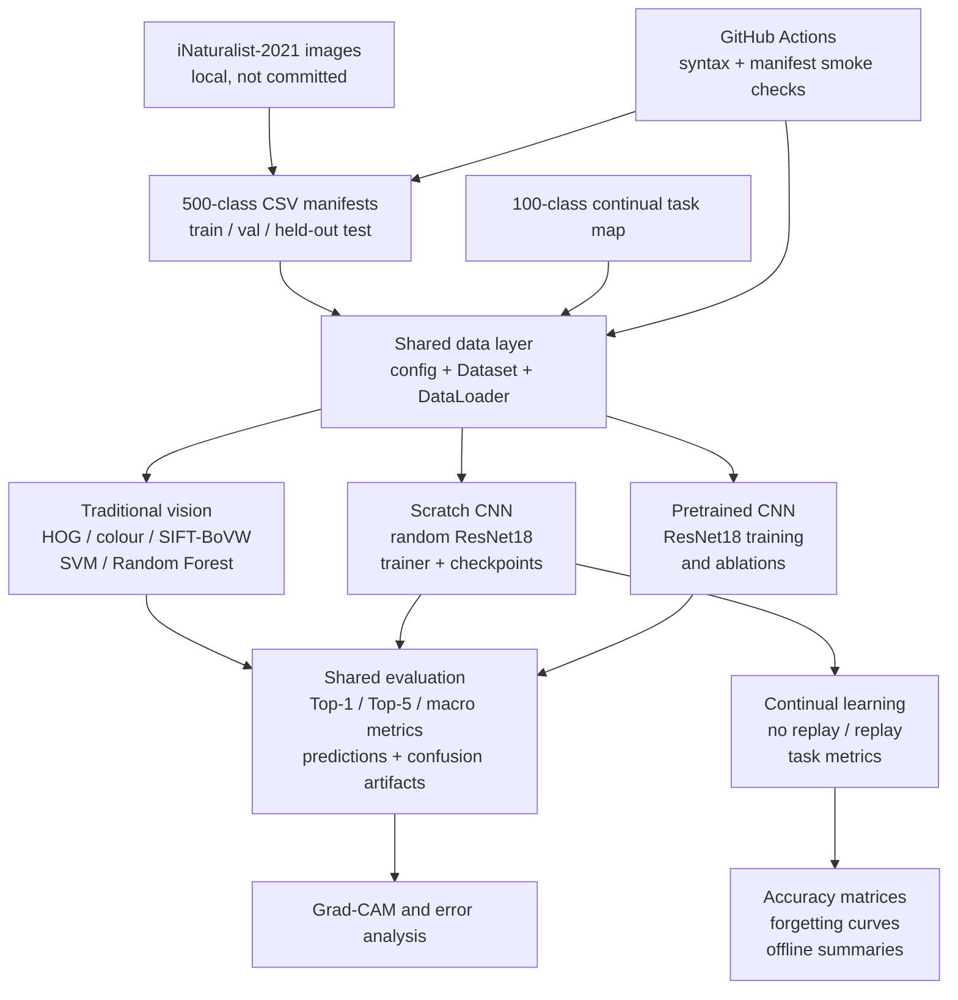

<h1 align="center">COMP9517 2026 T2 Group Project</h1>

<p align="center">
  Fine-grained species classification on a fixed iNaturalist-2021 subset
</p>

<p align="center">
  
  
  
  
</p>

<p align="center">
  <a href="#delivered-work">Delivered Work</a> &bull;
  <a href="#project-architecture">Architecture</a> &bull;
  <a href="#evaluation-snapshot">Evaluation Snapshot</a> &bull;
  <a href="#reproducibility">Reproducibility</a>
</p>

This repository contains the completed COMP9517 group project for fine-grained image classification. It provides a shared 500-class iNaturalist-2021 protocol, traditional computer-vision baselines, scratch and pretrained ResNet18 experiments, explainability evidence, and a 100-class continual-learning study.

> **Evaluation protocol.** Model choices were made using the validation split. The held-out test split was used for the fixed final configurations, with saved predictions, metrics, confusion artifacts, and analysis outputs kept outside Git.

---

## Delivered Work

| Area | Completed deliverables |
| --- | --- |
| **Data and infrastructure** | Deterministic 500-class manifests, shared label metadata, Dataset/DataLoader utilities, manifest checks, and lightweight GitHub Actions validation. |
| **Traditional vision** | HOG, colour-histogram, and SIFT Bag-of-Visual-Words features; nearest-centroid, Linear SVM, and Random Forest classifiers; held-out evaluation and error analysis. |
| **Scratch CNN** | Randomly initialized ResNet18, training/validation loops, loss and Top-1 curves, checkpointing, guarded resume support, held-out evaluation, and error analysis. |
| **Pretrained CNN** | ImageNet-pretrained ResNet18 training, ablations, checkpoint recovery, held-out evaluation, and Grad-CAM evidence. |
| **Advanced study** | Fixed 100-class / 10-task continual-learning protocol, sequential no-replay and replay baselines, class-balanced sampling, task-accuracy matrices, forgetting metrics, and offline comparison figures. |

## Dataset Protocol

The project uses a fixed, class-balanced subset of iNaturalist-2021. The committed CSV manifests define the experiment; the original image archive and generated outputs remain external to Git.

| Split | Images | Classes | Images per class | Role |
| --- | ---: | ---: | ---: | --- |
| `train.csv` | 20,000 | 500 | 40 | Model fitting |
| `val.csv` | 5,000 | 500 | 10 | Model selection and ablations |
| `test.csv` | 5,000 | 500 | 10 | Held-out final evaluation |

The packaged image subset is available through the [shared project download](https://unsw-my.sharepoint.com/:u:/g/personal/z5708767_ad_unsw_edu_au/IQCd2kjjFMcQQZvZZBUCLM74AUqhSjweb5B1IQGVrewxcrQ?e=5OEx5p). Detailed manifest fields and the expected archive layout are documented in [data/processed/README.md](data/processed/README.md).

## Project Architecture



## Evaluation Snapshot

All values below are from the completed configurations and their corresponding held-out test outputs unless otherwise stated.

| Route | Configuration | Top-1 result | Evidence |
| --- | --- | ---: | --- |
| Traditional vision | SIFT-BoVW + Linear SVM | 3.72% | Top-5 10.24%; macro F1 0.0258 |
| Scratch CNN | Augmented, randomly initialized ResNet18 | 24.40% | Top-5 49.12%; macro F1 0.2282 |
| Pretrained CNN | ImageNet-pretrained ResNet18 | 63.90% | Held-out 500-class evaluation and Grad-CAM outputs |

The scratch result was obtained from the best validation checkpoint (validation Top-1 24.58% at epoch 19). Its training loop records epoch timing, loss, and Top-1 history; the original completed Colab run took approximately 46 minutes on a Tesla T4.

### Continual-Learning Study

The advanced experiment uses a deterministic 100-class subset split into 10 sequential tasks. It keeps the classifier head class-incremental and evaluates all classes observed so far after each task.

| Final held-out condition | Current-task accuracy | Old-task accuracy | Seen-task accuracy | Average forgetting |
| --- | ---: | ---: | ---: | ---: |
| Sequential fine-tuning without replay | 16.00% | 0.00% | 1.60% | 0.2600 |
| Replay, 5 images per old class, class-balanced sampling | 28.00% | 1.89% | 4.50% | 0.3322 |

This study is reported separately from the required 500-class baselines. Its saved artifacts include task-by-task accuracy matrices, current/old/seen accuracy curves, average-forgetting curves, replay-memory summaries, and final metric tables.

## Repository Layout

```text
.
|-- .github/workflows/       # Lightweight CI checks
|-- data/
|   |-- processed/           # Committed 500-class and continual-task manifests
|   `-- raw/                 # Local image archive, ignored by Git
|-- outputs/                 # Local checkpoints, metrics, figures, and caches
|-- scripts/                 # Training, evaluation, analysis, and smoke-test entry points
|-- src/
|   |-- data/                # Dataset and DataLoader utilities
|   |-- traditional/         # Handcrafted features and classical classifiers
|   |-- deep_learning/       # ResNet18, trainer, checkpoints, and Colab notebooks
|   |-- advanced/            # Continual-learning components
|   |-- evaluation.py        # Shared classification metrics
|   `-- gradcam_selection.py # Reproducible Grad-CAM sample selection
|-- requirements.txt
`-- log.md                   # Project maintenance record
```

## Reproducibility

Install the project dependencies and verify the committed data contract:

```bash
pip install -r requirements.txt
python scripts/smoke_test.py
python scripts/summarize_data_manifests.py
python scripts/create_continual_task_plan.py --check
```

The CI workflow runs the same lightweight manifest checks, continual-learning contract checks, and syntax validation for pull requests and updates to `main`. It intentionally does not download image archives or run model training.

The committed notebooks are organised by method:

- [Traditional features](src/traditional/features/) and [classifiers](src/traditional/classifier/)
- [Scratch CNN and Colab execution](src/deep_learning/Task_D_Colab_Execution.ipynb)
- [Pretrained ResNet18 and Grad-CAM notebooks](src/deep_learning/)
- [Continual-learning scripts and result summaries](src/advanced/)

## Local Artifacts

Raw images, checkpoints, feature caches, predictions, plots, and presentation files are intentionally excluded from Git because of their size. The repository retains the manifests, implementation, notebook workflows, and validation contracts required to reproduce the completed experiments.
